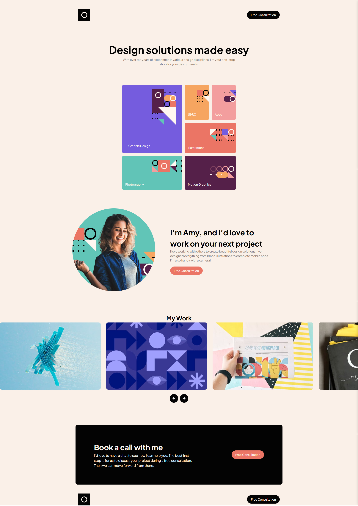

# Frontend Mentor - Single-page design portfolio solution

This is a solution to the [Single-page design portfolio challenge on Frontend Mentor](https://www.frontendmentor.io/challenges/singlepage-design-portfolio-2MMhyhfKVo). Frontend Mentor challenges help you improve your coding skills by building realistic projects. 

## Table of contents

- [Overview](#overview)
  - [The challenge](#the-challenge)
  - [Screenshot](#screenshot)
  - [Links](#links)
- [My process](#my-process)
  - [Built with](#built-with)
  - [What I learned](#what-i-learned)
  - [Continued development](#continued-development)
  - [Useful resources](#useful-resources)
- [Author](#author)
- [Acknowledgments](#acknowledgments)


## Overview

### The challenge

Users should be able to:

- View the optimal layout for the site depending on their device's screen size
- See hover states for all interactive elements on the page
- Navigate the slider using either their mouse/trackpad or keyboard

### Screenshot



### Links

- Solution URL: [Github](https://your-solution-url.com)
- Live Site URL: [Vercel](https://single-page-design-portfolio-iota-ruddy.vercel.app/)

## My process
For this project, I began by carefully planning the HTML structure based on the design layout. I focused on writing clean, semantic markup and then layered in styling with CSS, using a desktop-first approach. Once the layout was in place, I implemented CSS Grid to handle the design sections that required more structured alignment. I made adjustments as I went, constantly referencing the design to keep things pixel-consistent. Each part of the build was broken down step-by-step, making the process more manageable and efficient.


### Built with

- Semantic HTML5 markup
- CSS custom properties
- Flexbox
- CSS Grid
- Vanilla Javascript
- Desktop-first workflow

### What I learned

Use this section to recap over some of your major learnings while working through this project. Writing these out and providing code samples of areas you want to highlight is a great way to reinforce your own knowledge.

To see how you can add code snippets, see below:

```html
 <div class="grid-row-spread">
      <div class="graphic-box">
        <p>Graphic Design</p>
        
      </div>
      <div class="ux-box">
        <p>UI/UX</p>
        
      </div>
      <div class="apps-box">
        <p>Apps</p>
        
      </div>
      <div class="illustrations-box">
        <p>Illustrations</p>
        
      </div>
      <div class="photo-box">
        <p>Photography</p>
        
      </div>
      <div class="motion-graphics-box">
        <p>Motion Graphics</p>
        
      </div>
    </div>
```
```css
.grid-row-spread {
    display: grid;
    gap: 1rem;
    grid-template-areas:
        "graphic ux apps"
        "graphic illustration illustration"
        "photo motion motion";
    grid-template-columns: repeat(1, 1fr);
    justify-content: center;
}
```
```js
nextButton.addEventListener("click", () => {
  const maxScrollLeft =
    slidesContainer.scrollWidth - slidesContainer.clientWidth;

  if (Math.ceil(slidesContainer.scrollLeft) >= maxScrollLeft) {
    slidesContainer.scrollLeft = 0;
  } else {
    slidesContainer.scrollLeft += slideWidth;
  }
});
```

### Continued development

While I’ve built several one-page layouts before, this challenge pushed me to refine how I approach responsiveness and component structure. Once I’m more confident with those concepts, I plan to explore frameworks for both JavaScript and CSS to expand my workflow. Each project gives me something new to take forward — whether that’s writing cleaner code, thinking more modularly, or just trusting my process. The learning never really stops, and that’s what keeps it exciting.


### Useful resources

- [mdn web docs](https://developer.mozilla.org/en-US/docs/Web/CSS/CSS_grid_layout) - When working on the grid section of this project, I leaned heavily on MDN Web Docs to clarify how grid-template-columns and auto-fit work in practice. Their examples helped me understand how to combine minmax() with repeat functions for responsiveness. I also referenced their explanations on alignment properties to fine-tune the spacing between items. The documentation is always clear, and I’ve made it a habit to check there when I hit a layout snag.
- [envato](https://webdesign.tutsplus.com/how-to-build-a-simple-carousel-with-vanilla-javascript--cms-41734t) - Creating the JavaScript carousel started with research, and I found a helpful guide on Envato Tuts+ that explained how to build a basic scrollable image slider. It broke down the logic of scrolling by image width and controlling movement with button clicks. I adapted the approach to suit my project’s needs and used it to create a cleaner sliding experience for the “My Work” section. It gave me a good foundation to build on and customize further.


## Author

- Frontend Mentor - [@EAguayodev](https://www.frontendmentor.io/profile/EAguayodev)

## Acknowledgments
Special thanks to Jemima Abu for her CodePen sample and detailed article on building JavaScript carousels. Her code offered a simple structure that helped me visualize how the scroll interaction could be tied to index tracking. I modified parts of it to fit the layout and behavior I wanted, and her breakdown made the concepts click. Huge appreciation for sharing her work — it played a big role in helping me create my own version with confidence.